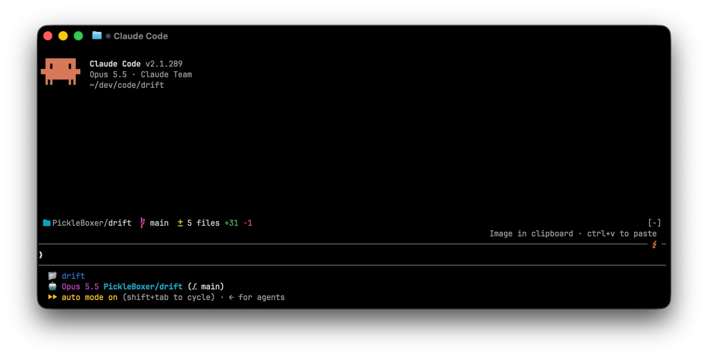

# drift

A [Claude Code mod](https://code.claude.com/docs/en/plugins/mods/overview) that shows how far your working tree has drifted from the last commit: the folder, the branch, how far it is ahead of or behind its upstream, and the uncommitted changes, above the prompt.



With the default icons:

```
❐ PickleBoxer/dotfiles   ⎇ main ↑2 ↓1   ± 4 files +83 -1
```

- **Band above the prompt**: the repository as `owner/repo` from the `origin` remote (the folder name when there is none), the branch (or the commit when HEAD is detached), commits ahead and behind the upstream, and the changed files with lines added and removed. Untracked files count as added lines.
- **Press a part of the band**: the folder opens in Finder, the branch opens the Branches tab, the changes open the Changes tab. Click it where your terminal reports clicks, or press `ctrl+x tab` to focus the band, then Tab and Enter.
- **`/drift`**: a pane with two tabs. **Changes** (`c`) lists every changed file with its status and line counts, followed by the diff: every file stacked, or straight away the one file when only one changed. Pressing a file shows only its diff, **All files** (`a`) goes back. **Branches** (`b`) lists local branches with their upstream, ahead and behind counts and last commit, and when you last fetched. `/drift branches` opens that tab directly. **Open in Finder** (`o`) and **Refresh** (`r`) are there too.
- **Switching branches**: press a branch, then **Switch** (`y`) or **Cancel** (`n`). drift refuses while tracked files have uncommitted changes, and shows git's own error when the switch fails.

The Desktop app already shows the folder, branch and changes above the prompt, so drift draws no band there.

## Install

Requires Claude Code v2.1.287 or later.

```
/plugin marketplace add PickleBoxer/drift
/plugin install drift@drift
```

## Where the numbers come from

- **Branch, upstream, ahead and behind, and the changed files** come from `git status --porcelain=v2`.
- **Line counts** come from `git diff --numstat HEAD`, so staged and unstaged changes count together. Untracked files are read and their lines counted, up to 200 files of at most 1 MB each. Binary files show as `binary`.
- **Ahead and behind** compare with the upstream as of your last fetch. drift never fetches by itself, so it causes no network traffic and no SSH prompts.
- **When it refreshes**: at session start, after every Edit, Write or Bash call, at the end of each turn, and every 5 seconds to catch changes made outside Claude. git runs with optional locks off, so the polling never blocks a git command you run yourself.

## Configuration

`terminalIcons` picks the band's icons: `plain` (default) draws `❐ ⎇ ±`, which work in any font, `nerd` draws [Nerd Font](https://www.nerdfonts.com) icons for the folder, the branch and the diff. Change it in `/config`, or in `~/.claude/settings.json`:

```json
{
  "pluginConfigs": {
    "drift@drift": { "terminalIcons": "nerd" }
  }
}
```

`showOwner` (default on) shows the owner before the repository name, as `owner/repo`. Turn it off to show the repository name alone:

```json
{
  "pluginConfigs": {
    "drift@drift": { "showOwner": false }
  }
}
```

## Development

```
claude --plugin-dir .          # loads the mod and reloads it on save
claude plugin validate .claude-plugin/plugin.json
claude plugin test .
```

## License

MIT
